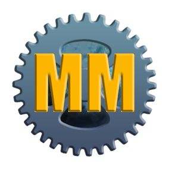

<p align="center">
  
</p>
<p align="center">
  
</p>

# MT2 Mod Manager

A community mod manager for **MMORPG Tycoon 2**. A game that allows you to build your own MMORPG, manage it and see it thrive (hopefully).

The mod manager allows you to download as many mods as you want while the manager handles their merging, versioning and warning you about potenial conflicts.

Merging is required because the if mods were to edit original game files (vanilla files), and another mod edits that same file, only one of the mod's changes will survive when you launch the game. Using the Mod Manager and loading your mods through it fixes that.

 Stuff it does:

- **Merging instead of overwriting:** A mod only contains what it adds or changes. The manager
  combines it with the current game data and every other enabled mod.
- **Load order:** You pick the order. In some cases the thing that changed can't be merged, but you can choose which mod's changes survives, at least.
- **Mod Ids (WIP):** Mod Authors **need** to specify an ID for their mod now. Acts as a namespace for the content. In the case that two mods choose to implment a button with the same name, both can be registered fine.
- **Mod profiles:** Each profile has its own applied mods, load order and enabled states. Switch profiles, press Launch, and the game gets that set.
- **Keeps up with game updates.** Every deploy rebuilds from the game's current
  `Data/MMORPG.zip`.

## Using it

1. Install and start **MT2 Mod Manager**. It finds the game automatically. If it can't, set both under **Tools -> Settings** in top toolbar.
2. **Add mod** adds a zip or folder that has a `manifest.json`.
3. **Add folder** adds every
   mod (sub-folders and `.zip` files with a `manifest.json`) inside a folder. You can also drop
   `.zip` files and folders onto the window.
4. In **Applied Mods**, drag mods (or use ▲/▼) to set the load order and tick the ones to use.
5. **Add to profile** adds the selected available mods to the profile; ✕ takes one out again.
6. **Issues** lists errors, conflicts and warnings in your applied mods.
7. **Launch** will launch the game with the applied mods and their configurations.

Making a mod? **Tools -> Add dev mod…** keeps it in your own folder: a refresh button next to it copies your latest changes in. See [docs/MODDING.md](docs/MODDING.md#testing-your-mod).

## Configs

Under the **Details** tab, mod authors can provide users varied options to configure, allowing users to customize their modded experience.

**Profiles** maintain their own configs just like they maintain their own list of active/enabled mods.

## For mod makers

See [docs/MODDING.md](docs/MODDING.md)

Check out `manifest.json` and `config.json` in the example mods:

- [examples/cash_plus](examples/cash_plus/)
- [examples/crunch_techs](examples/crunch_techs/)
- [examples/toolbox](examples/toolbox/)

## Building from source

### Requires


### Build it

```sh
cargo test -p mt2mm-core                  # set MT2_GAMEDATA=<GameData dir or MMORPG.zip> for the full tests
cargo build --release -p mt2mm-cli        # command-line tool -> target/release/mt2mm
cd app && npm install && npx tauri build  # desktop app + installer -> target/release/bundle/
```

While working on the app, `cd app && npx tauri dev` runs it with the page served live, and
`npm run typecheck` checks the TypeScript.

**Linux** also needs **WebKitGTK**: `libwebkit2gtk-4.1-dev libappindicator3-dev librsvg2-dev`.

## Thank you

To the team behind MMORPG Tycoon 2 for making an awesome game <3

To the awesome MMORPG community <3
